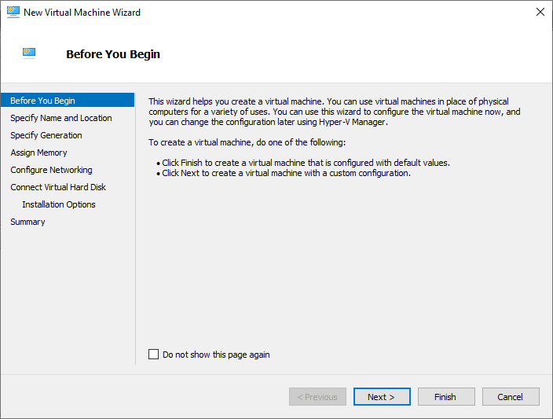
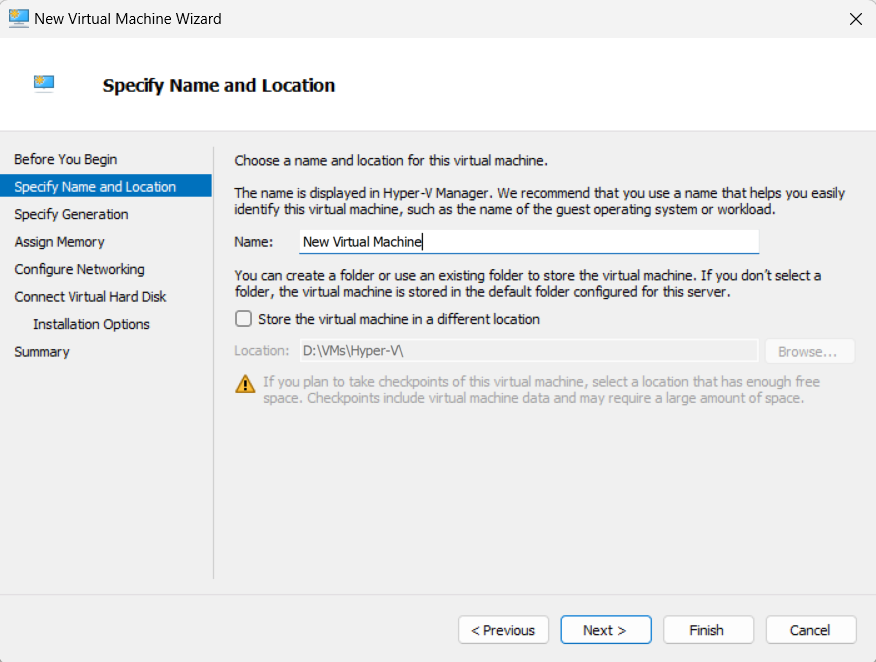
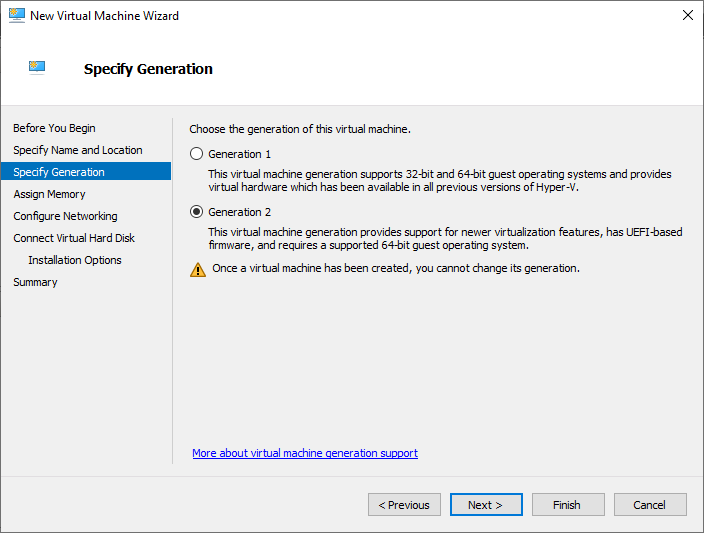

# How To Create a Linux Virtual Machine

## Content
1. [Create a New Virtual Machine](#1-create-a-new-virtual-machine)
2. [Specify the Virtual Machine Name and Location](#2-specify-the-virtual-machine-name-and-location)
3. [Specify the Generation](#3-specify-the-generation)
4. [Assign Memory](#4-assign-memory)
5. [Configure Networking](#5-configure-networking)
6. [Create a Virtual Hard Disk](#6-create-a-virtual-hard-disk)
7. [Select Linux Distro iso file](#7-select-linux-distro-iso-file)
8. [Complete the New Virtual Machine Wizard](#8-complete-the-new-virtual-machine-wizard)
9. [Configure Created Virtual Machine For Linux](#9-configure-created-virtual-machine-for-linux)

### 1. Create a New Virtual Machine

* In the Hyper-V Manager window, click on **New** in the Actions panel on the right.

* Select **Virtual Machine** and click Next.

    

### 2. Specify the Virtual Machine Name and Location

* Enter a Name for your virtual machine (*e.g., "UbuntuVM"*).

* Choose a Location to store the virtual machine configuration files (e.g., "*C:\VMs*").

* Click **Next**.

    

### 3. Specify the Generation
> **Generation 1 and Generation 2** virtual machines are two different types of virtual machines that can be created in Hyper-V. The main difference between the two is the **firmware** used to boot the virtual machine.

> **Generation 1** virtual machines use BIOS (Basic Input/Output System) firmware, which is the traditional firmware used in most physical computers. BIOS firmware is limited in terms of the hardware devices it can support and the security features it provides.

> **Generation 2** virtual machines, on the other hand, use UEFI (Unified Extensible Firmware Interface) firmware, which is a newer and more advanced firmware that provides better security features and supports newer hardware devices.

> I use Gen2 which give us more features but You can find more information [here](https://learn.microsoft.com/en-us/windows-server/virtualization/hyper-v/plan/should-i-create-a-generation-1-or-2-virtual-machine-in-hyper-v).
* select Geneation 2.

* click **Next**.

    

### 4. Assign Memory

### 5. Configure Networking
### 6. Create a Virtual Hard Disk
### 7. Select Linux Distro iso file
### 8. Complete the New Virtual Machine Wizard
### 9. Configure Created Virtual Machine For Linux