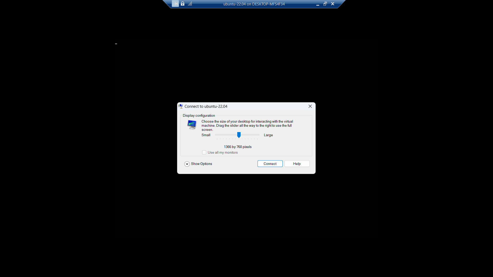
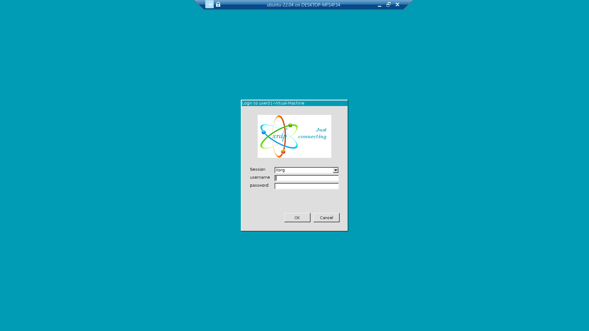

## What is Enhanced Session Mode?

Hyper-V enhanced session mode is a feature that allows you to have a more seamless experience when working with virtual machines. This mode provides access to local resources, such as the clipboard and printers, and improved display and audio performance.

Some of the benefits of Enhanced Session Mode include:

- **Improved Display Resolution**: Enhanced Session Mode supports dynamic screen resolution changes, allowing the VM's display to resize to fit the window on the host.

- **Audio redirection**: Audio from the VM is redirected to your local machine, allowing you to hear audio from the VM.

- **Clipboard sharing**: You can copy and paste text and images between your local machine and the VM.
- Printer redirection: You can print from the VM to your local printers.

- Multi-monitor support: You can use multiple monitors to connect to a VM, just like you would with a physical machine.

- USB device redirection: You can redirect USB devices from your local machine to the VM.

> You can find more information in [here](https://learn.microsoft.com/en-us/windows-server/virtualization/hyper-v/learn-more/use-local-resources-on-hyper-v-virtual-machine-with-vmconnect#choose-a-local-resource).

> **NOTE**: If You don't use Enhanced Session Mode depending on your Linux distro, You would have **Display and Audio** Problems.

## How to make it work in GNU/Linux?

1. base on your distro run the script:

   > **IMPORTANT NOTE:** Make sure the auto-login **is disabled**.

   > If the script executes successfully, Enhanced Session Mode and Hyper-V Integrated Services will be enabled on your virtual machine.

      <br>
      <details>
      <summary> Ubuntu (Gnome)</summary>
      <br>
      <blockquote><b>NOTE:</b> Make sure that you have <b>curl</b> installed.</blockquote>
      <h3> 24.04 </h3>
      <pre><code>
      sudo bash -c "$(curl -sSL https://raw.githubusercontent.com/ali-hasehmi/LinuxVM-HyperV/main/enable-enhanced-session-mode/ubuntu/install24_04.sh)" 
      </pre>
      </code>

      <h3> 22.04 </h3>
      <pre><code>
      sudo bash -c "$(curl -sSL https://raw.githubusercontent.com/ali-hasehmi/LinuxVM-HyperV/main/enable-enhanced-session-mode/ubuntu/install22_04.sh)" 
      </pre>
      </code> 
      </details>
      <details>
      <summary>Arch/Manjaro</summary>
      <br>
      <blakckquote><b>NOTE:</b> I've tested the script on Manjaro 24.0.3 with KDE-Plasma Desktop, It should be find with Arch and other Arch base distros. If You had problem with starting your DE/WM, try to configure ~/.xrdpinitrc base on your DE/WM.
    <pre><code>
    bash -c "$(curl -sSL https://raw.githubusercontent.com/ali-hasehmi/LinuxVM-HyperV/main/enable-enhanced-session-mode/manjaro/install.sh)" 
    </pre>
    </code>
      </details>

      <br>
      <br>

2. then turn off your virtual machine machine, and then using PowerShell (run as Administrator), you need to enable hv_sock on you machine:

   ```powershell
   Set-VM -VMName Your_Virtual_Machine_Name__ -EnhancedSessionTransportType HvSocket
   ```

   > Replace \_Your_Virtual_Machine_Name\_\_\_ with your actual virtual machine name.

3. If anything went well, You'd see something like this when You start the VM:

   

   You can change screen size, redirecting audio and microphone, accessing devices...

4. After that You would see xRDP login page:

   

5. Enter Your username and password and _hopefully_ you would see your desktop.
