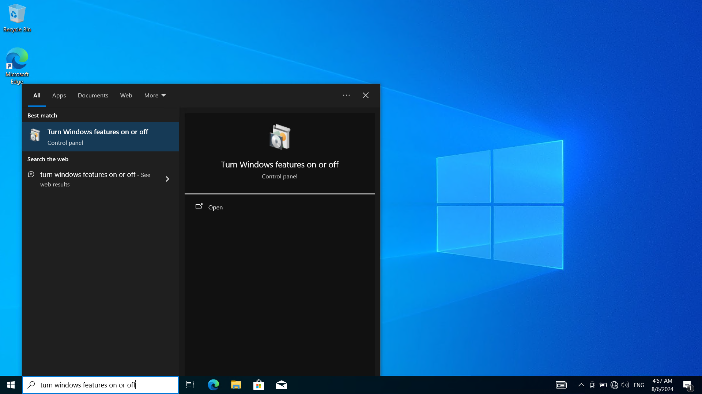
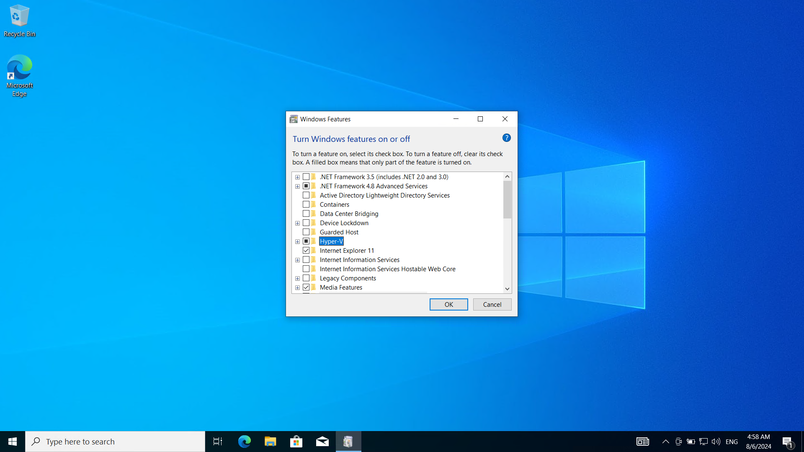
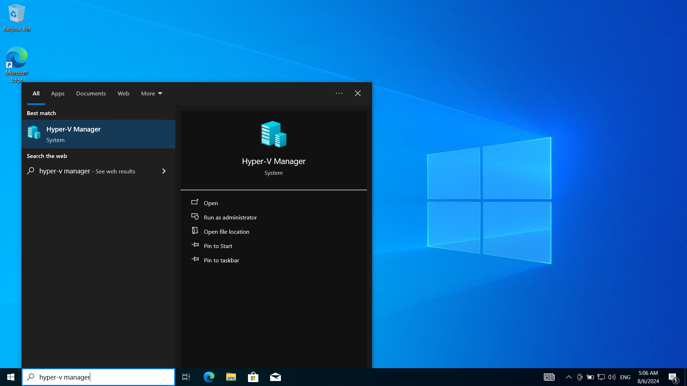
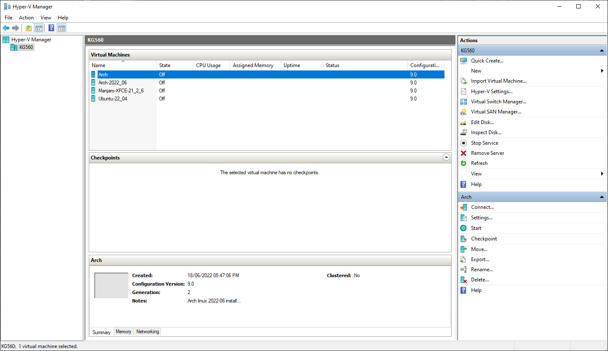
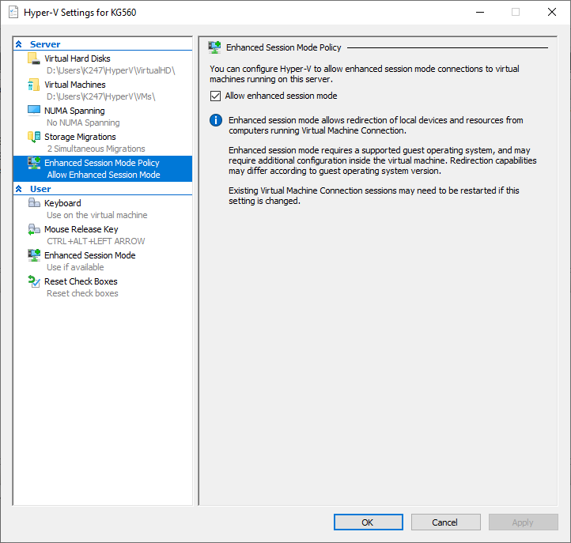
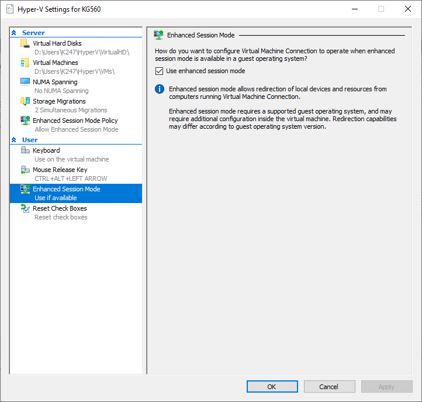
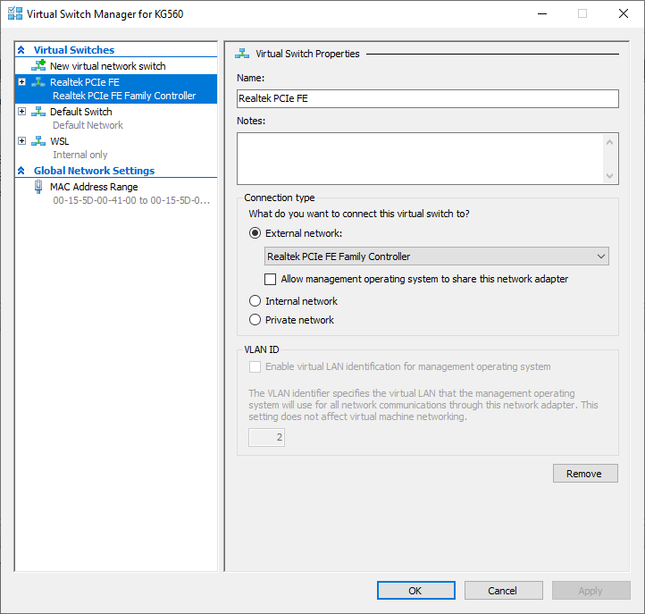

# How to enable hyper-v in Windows 10/11

> **Important Note:** Before proceeding, ensure your system meets the requirements for Hyper-V. Please verify your system's compatibility to avoid any issues. You can find more information on the system requirements [here](https://learn.microsoft.com/en-us/virtualization/hyper-v-on-windows/reference/hyper-v-requirements).

>**Important Note:** Enabling Hyper-V may affect compatibility with other third-party virtualization software, such as VirtualBox and VMware. If you rely on these tools, please consider the implications before enabling Hyper-V. You can find more information [here](https://learn.microsoft.com/en-us/troubleshoot/windows-client/application-management/virtualization-apps-not-work-with-hyper-v).

# Content
1. [Enable Hyper-v](#1-enable-hyper-v)
2. [Restart your computer](#2-restart-your-computer)
3. [Launch Hyper-v Manager](#3-launch-hyper-v-manager)
4. [Enable Enhanced Session Mode](#4-enable-enhance-session-mode)
5. [Create An External Virtual Switch](#5-create-an-external-virtual-switch)

## 1. Enable Hyper-v
* Press the **Windows key + S** to open the Search bar.

* Type **"Turn Windows features on or off"** and select the result.

    

* In the Windows Features window, scroll down and check the box next to **"Hyper-V"**.

    
* Click **"OK"** to save the changes.

## 2. Restart your computer

* Restart your computer to apply the changes.
## 3. Launch Hyper-v Manager

* Press the **Windows key + S** to open the Search bar.

* Type "**Hyper-V Manager**" and select the result.

    

* The Hyper-V Manager window will open, where you can create and manage virtual machines.

    

## 4. Enable Enhance Session Mode
* Open Hyper-V settings from the Actions menu on the right.

* In the Server section, navigate to the Enhanced Session Mode Policy option and make sure it is enabled by checking the corresponding box.

    

* In the User section, locate the Enhanced Session Mode Policy option and enable it by checking the corresponding box.

    

* click "**ok**".

## 5. Create An External Virtual Switch

 > By default, Hyper-V creates a virtual switch with a NAT configuration inside your host and calls it the **Default Switch**. The problem with this configuration is that other devices on your local network cannot connect to your virtual machine directly. Therefore, we create an external virtual switch (also known as a bridged network or **External Switch**) to make the virtual machine         accessible on the LAN. see [here](https://learn.microsoft.com/en-us/windows-server/virtualization/hyper-v-virtual-switch/hyper-v-virtual-switch) for more information.

 * Open the **Virtual Switch Manager** from Actions Menu on the right.
 
 * Select **External** as swtich type and then click on **Create Virtual Switch**

 * you can give the switch any arbitrary name you prefer 
 
 * Choose the physical network interface you want to associate with the virtual switch.

    

* click **"ok"**.